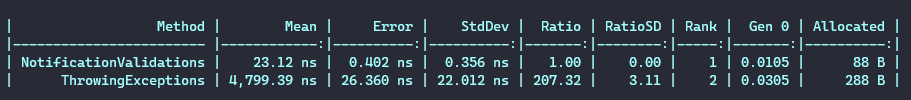

# Throwing Exceptions Vs Notification Validations


## Run project
On root project folder

```bash
./benchmark.bat
```


## Results



## References
- [Roger Maza](https://www.linkedin.com/feed/update/urn:li:activity:6894682519170879488/)
- [Martin Fowler](https://martinfowler.com/articles/replaceThrowWithNotification.html)
